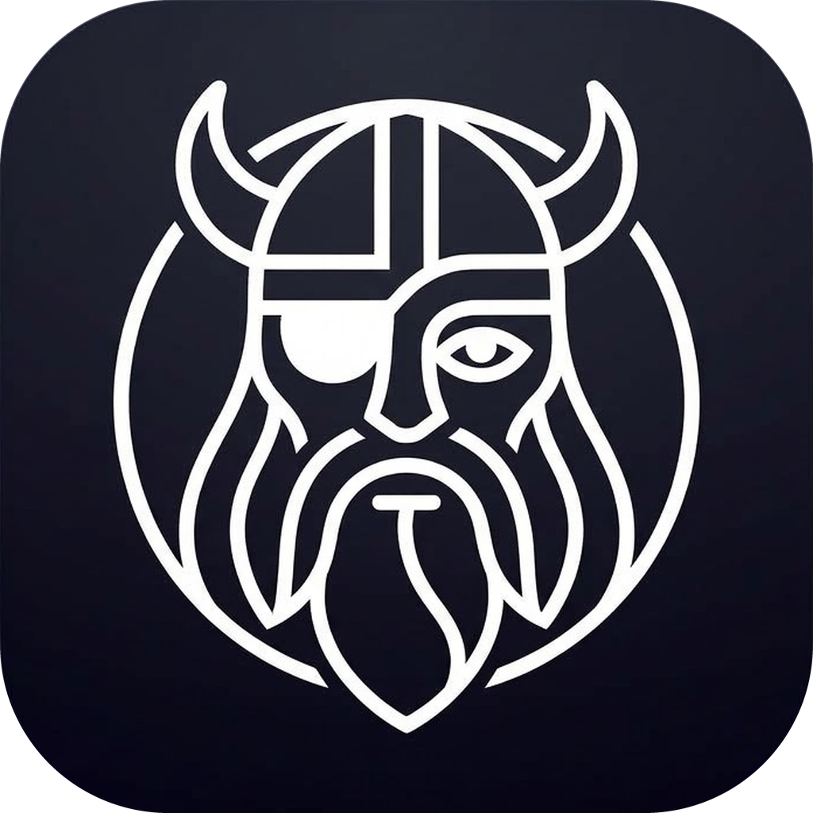
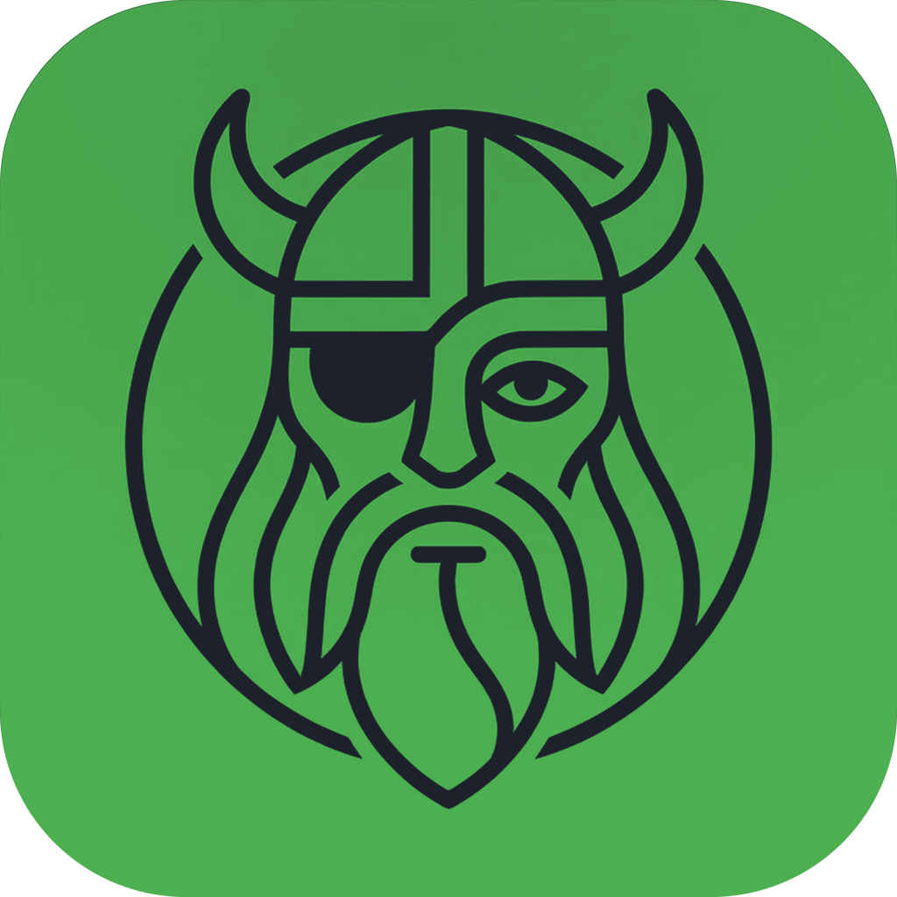

<p align="center">
  
</p>

<h1 align="center">Odin</h1>

<p align="center">
  <b>A personal work console for delegating to coding agents.</b>
</p>

<p align="center">
  <a href="LICENSE.md"></a>
  <a href="#install"></a>
  <a href="https://github.com/danlinenberg/odin/actions/workflows/release.yml"></a>
</p>

<p align="center">
  <a href="#install">Install</a> ·
  <a href="#the-idea">The idea</a> ·
  <a href="#the-loop">The loop</a> ·
  <a href="#what-odin-is-not">What it is not</a> ·
  <a href="#where-its-going">Where it's going</a>
</p>

---

Odin runs many CLI agents in parallel on your own machine and keeps them in the
same place as the work that drives them — a Slack thread, a Jira issue, a review
request. One queue, one board, one thing to look at.

## Install

macOS on Apple Silicon:

```sh
brew trust --cask danlinenberg/odin/odin && brew tap danlinenberg/odin https://github.com/danlinenberg/odin && brew install --cask odin && xattr -dr com.apple.quarantine /Applications/Odin.app
```

### Upgrade

```sh
brew upgrade --cask --greedy odin && xattr -dr com.apple.quarantine /Applications/Odin.app
```

### From source

Needs [Bun](https://bun.sh) at the version pinned in `.bun-version`:

```sh
git clone https://github.com/danlinenberg/odin.git
cd odin
bun install
bun dev          # run it
bun run build    # or package one: apps/desktop/release/
```

 &nbsp;A dev build wears the green icon, so the one you are hacking on and the
one you are working *in* are never the same thing in the dock.

## The idea

Most people run two systems and hold both in their head at once.

One is where the **work** lives: tickets, threads, review requests, a list
somewhere. The other is where the **agents** live: terminals, worktrees,
sessions. Neither knows the other exists. You read the first to work out what
matters, retype it into the second, and then pay for the gap in both directions —
the agent can't tell you which request it came from, and the request can't tell
you an agent ever touched it. Nothing is marked done in one place because
something finished in the other.

That split is a tax on the only thing that's actually scarce.

Running agents is no longer the hard part; you can have six working at once on a
laptop. What runs out is **your attention** — deciding what to hand over,
noticing which one is stuck, remembering what a session was even about when you
come back to it an hour later.

**Odin is one system.** Your queue and your agents are the same screen: a row in
the queue becomes a running session, the session remembers the row it came from,
and the board and the queue are two views of one pile of work rather than two
piles you reconcile by hand.

Every part of it buys back a piece of that same scarce thing:

| | what it saves you |
|---|---|
| One queue across every source | "where do I even look" |
| A board by agent state | "which of these needs me" |
| Written briefs | "what was happening here" |
| Session provenance | "why did I start this" |
| Insights | "what's piling up" |

## The loop

**See what's on you → hand it to an agent → notice when it needs you → pick it
back up.**

That's the whole product. Everything below is one of those four steps.

### See what's on you

Five sources land in one queue:

- **Slack** — react `:eyes:` to a message and it becomes a row. The gesture you
  already make is the capture.
- **Jira** — issues assigned to or reported by you.
- **GitHub** — pull requests waiting on your review, bots filtered out.
- **Notion** — rows from a database you pick.
- **Tasks** — things you type in yourself.

The **All** tab is every source at once. Tab badges count what is genuinely
waiting on you, not how many rows exist, so a dependency-bump spree doesn't read
as work.

### Hand it to an agent

One click on any row starts a session: a real terminal agent, in a git worktree,
with a prompt built from the item — the Slack thread and what was said in it, the
issue key and its description, the PR and what it changes.

Launches are paced to the machine. If the Mac is already loaded, a new session
waits for room instead of starting a sixth agent into a swap storm, and says so
while it waits.

Odin drives whichever agent CLI you use, with your own subscription. Nothing is
proxied and nothing leaves the machine.

### Notice when it needs you

The **Dev Board** is a kanban over live agent state, not ticket state:

```
Working        Needs you        Done        Idle
```

Cards group by where the work came from, so nine cards read as "four Slack
threads, two Jira, three of mine" rather than an undifferentiated list. Statuses
come from agent lifecycle hooks, with the session's own screen read as a fallback
so a card stranded by a lost hook still corrects itself.

### Pick it back up

Re-entry is where the time actually goes, so it gets real machinery:

- **Briefs** — a model reads the transcript and answers "what did I walk into?".
  Not an excerpt: the opening request is a wall of prose and the last turn is 300
  words of markdown, and reading both is the job the panel is supposed to be
  doing for you.
- **Session History** — search every agent conversation on the machine by what
  was *said* in it, read it, resume it. Each row is tagged with where it came
  from, because a generated title like "Review Slack thread" loses the fact that
  a named person asked for it.
- **Insights** — how much lands on you, how much you hand over, how long things
  sit before you get to them, and who asks most.

Terminal sessions are owned by a background daemon, so they survive the window
closing, the app restarting, and the app being rebuilt under them.

## What Odin is not

These are constraints, not gaps. They are what let it be opinionated.

- **Not a team tool.** One person, one machine. No assignment, no shared state,
  no seats. The moment it serves a team it has to serve the average of a team.
- **Not a cloud service.** Your hardware is the ceiling — which is exactly why
  launches are paced to it.
- **Not fire-and-forget.** Odin is built to put you back in the loop at the right
  moment, not to hand you finished work you never watched.
- **Not an editor.** It starts, watches and reviews. You still open your IDE.

## Who it's for

The person who is a **human router**: work arrives as pings, review requests and
tickets other people filed. Most of it could be handed to an agent. More time
goes to re-entering context than to writing code.

In one line — **an agent launcher for people whose work doesn't arrive as
tickets.**

## Where it's going

The arc is **inbox → router**.

Today Odin shows you the queue and you make every call: which item, which repo,
which prompt. Those are small judgments made dozens of times a week, and most of
them aren't interesting.

The direction is that Odin proposes and you approve — *this looks like the
export-retry kind of ask, repo X, here's the prompt, go?* — with rejecting a
suggestion cheap enough that a wrong guess costs one keystroke. Getting there
means recording not just what you delegated but how it turned out, and having
enough history to see the pattern.

The endpoint is not agents working unattended. It is that the routine fraction
drains itself, and **what reaches you is the work that actually needs a human.**

## Status

Pre-production and single-user. It is used daily by the person building it, which
is the only quality bar it currently has to clear.

## License

Elastic License 2.0. See [LICENSE.md](LICENSE.md).
